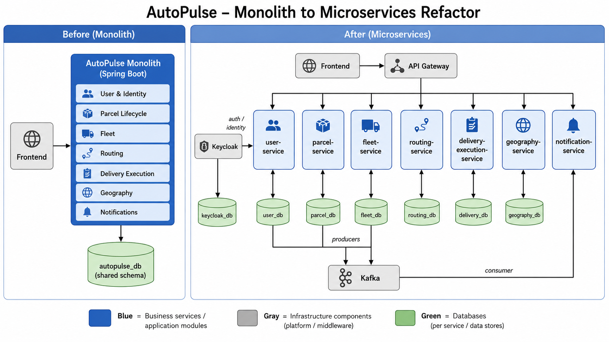

# Architecture

## 1. High-Level View

The system is composed of:

- separate frontend (`AutoPulse-frontend`)
- microservices backend (`AutoPulse-backend`)
- cloud-native infrastructure (gateway, discovery, auth, messaging, observability)

## 2. Main Flow

1. Frontend -> `api-gateway`
2. Gateway -> business services
3. Services -> registry (`discovery-service`)
4. Auth through Keycloak
5. Some events through Kafka

## 3. Logical Diagram

## 4. Deployment

- local compose: `AutoPulse-backend/docker-compose.yml`
- Kubernetes manifests: `AutoPulse-backend/k8s/*.yaml` and `AutoPulse-backend/k8s-aks/*.yaml`

## 5. Architectural Conclusion

The "independent deployment" criterion is met: business services are independent build and deployment units, with separate configurations and ports, integrated through contracts and cloud-native infrastructure.
